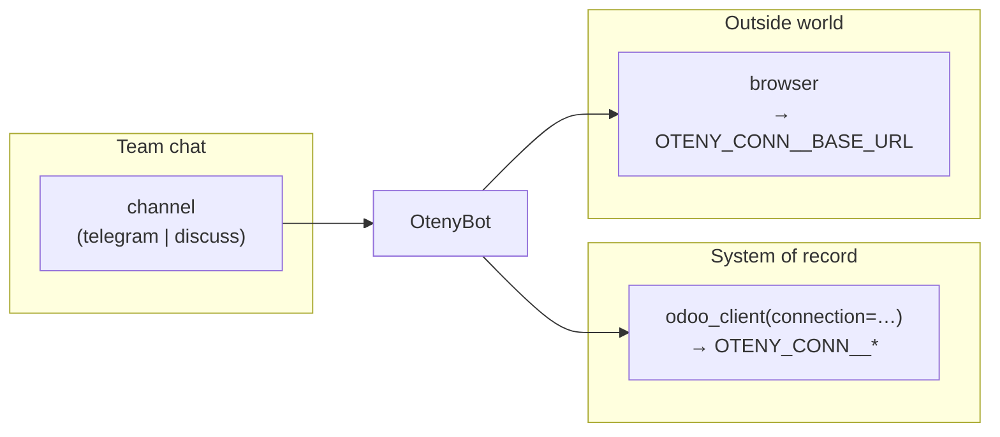

# Oteny Talents — author glossary

Plain-language terms for Talent authors. This is the vocabulary you use in
`agent-profile.yaml`, skills, and tests — not internal platform jargon.

| Term | Meaning |
| --- | --- |
| **OtenyBot** | Your customer's hosted agent instance on Oteny — one bot, one box, one delivered Talent tree. You reach it through the Oteny dev CLI and `/json/2/` record APIs, scoped by your account key. |
| **Talent** | A self-contained bundle under `skills/<name>/` (or your own repo): `agent-profile.yaml`, skills, optional `references/`, `tests/`, and `neutralize.yaml` when the bot has outbound actions. Fully replaced on every delivery — never a place for per-tenant state. |
| **connection** | A **named** bind to an outside system, declared under `connections:` in `agent-profile.yaml`. The platform writes managed env vars on the bot box; your skills reference those vars, never hard-coded URLs. |
| **odoo_client** | The model tool for Odoo `/json/2/` calls — the **data plane**, independent of chat channel. Mounts whenever the Talent declares an odoo `connections:` bind. Every call passes `connection=<name>` (URL, database, API key come from env). |
| **channel** | Where the bot **talks** — the team chat surface. `routing.channel: telegram` → Telegram DM/groups; `routing.channel: discuss` → Odoo Discuss (usual for internal teams). Channel choice is UX/GTM, not what unlocks Odoo. |
| **home_connection** | Under `routing:` — the **odoo** connection name **Discuss polling** uses only (`OTENY_HOME_CONNECTION`). Required on Discuss bots; omit on Telegram (Telegram uses `odoo_client(connection=…)` without a poll target). |
| **scope-lock** | The locked toolbox: `toolset_contribution` + `tools.required` list exactly what mounts; generic shell/code/search tools stay off unless the job truly needs them. Enforced again at the gateway on locked instances. |
| **neutralize** | `neutralize.yaml` — the clone-time de-fanging checklist (disable crons, repoint connections to stubs) so a disposable test bot never fires a live action. Mandatory when the Talent declares connections or outbound crons. |
| **stub** | The non-prod **double** of a side-effecting system (portal, mailbox, …): records intent without doing the real thing. Dev/staging tiers mount the stub; prod mounts the real adapter. You host the stub in your repo and tunnel it. |
| **Path B dog-food** | The author loop where **you** run your stub double locally, tunnel it, and hand the URL to the platform at commission time (`stub_endpoints`) — not relying on Oteny-hosted fixtures. See `business-bot-pattern.md` §4c. |
| **Talent uv runtime** | When a tenant script needs a non-stdlib library (e.g. `matplotlib`), the Talent ships `pyproject.toml` + `uv.lock` (+ `.python-version`). The platform runs `uv sync --frozen` at converge into `~/.hermes/runtimes/<slug>/`. Invoke feature scripts with `talent-run <slug> <rel-script>` (or `uv run --project …`). Readiness scripts (`preflight` / `selfcheck`) stay on bare `python3` (stdlib only). `runtime.python_packages` in `agent-profile.yaml` is a transitional union hint during dual-run — the lock is authoritative. Worked example: `oteny-flatbelly-talent`. |

## How the pieces fit

- **channel** → where operators message the bot.
- **odoo_client(connection=…)** → read/write the business Odoo (workflow state, grants, proof records).
- **browser** → drive a **portal** connection (filing, login walls, confirmations read from the page).

Named env convention: `OTENY_CONN_<NAME>_URL`, `_DB`, `_KEY` for odoo; `OTENY_CONN_<NAME>_BASE_URL` for portal (`<NAME>` uppercased, non-alnum → `_`).
